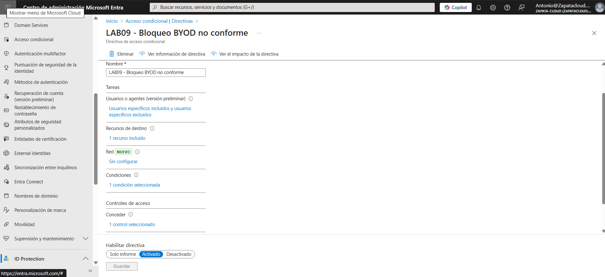
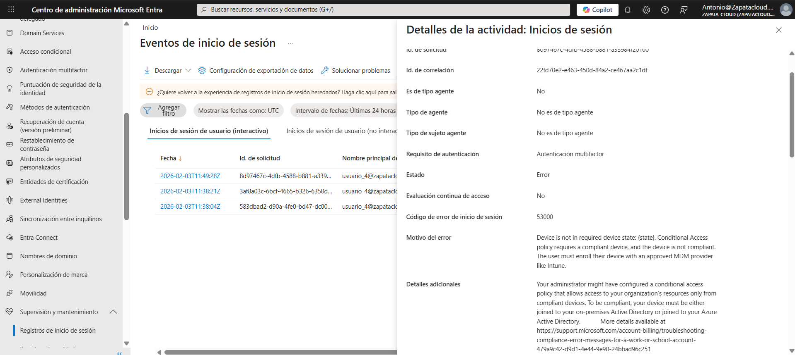
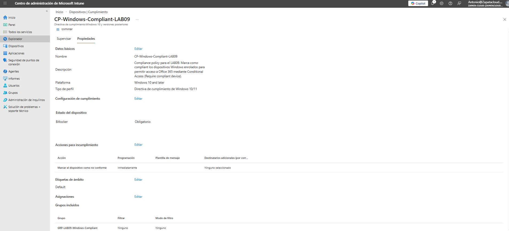
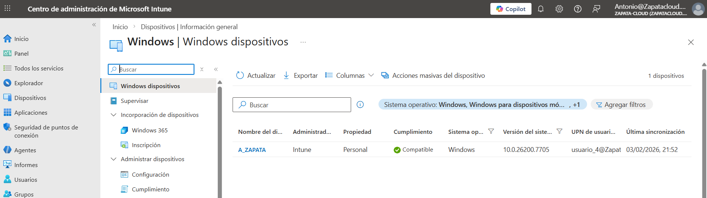

# LAB 09 — Conditional Access: Bloqueo de BYOD no conforme  
**(Require Compliant Device + Intune)**

## Contexto (por qué hice este lab)
En entornos reales, un problema típico es el acceso desde dispositivos personales (BYOD) sin control:  
PCs sin cifrado, sin antivirus corporativo, sin políticas, etc.

La idea de este laboratorio es simple y muy práctica:  
si el dispositivo **no está enrolado** y **no cumple** (no es *compliant*), **se bloquea el acceso** aunque el usuario tenga la contraseña correcta.

---

## Objetivo
Permitir el acceso a aplicaciones corporativas **solo** desde dispositivos que cumplan estas condiciones:

- **Enrolados en Intune**
- **Marcados como compliant**
- Validado por **Conditional Access**

Resultado esperado:
- ❌ Dispositivo BYOD no compliant → **bloqueado**
- ✅ Dispositivo compliant → **permitido**

---

## Tecnologías utilizadas
- **Microsoft Entra ID (Azure AD)**
- **Conditional Access**
- **Microsoft Intune**
- **Sign-in logs**

---

## Qué configuré

### A) Intune (cumplimiento del dispositivo)
Para que exista el estado *compliant*, el dispositivo debe estar gestionado por Intune.  
Por eso configuré:

- Una **directiva de cumplimiento (Compliance policy)** para **Windows**
- Asignación a un **grupo de pruebas**
- Un dispositivo Windows enrolado que pueda pasar a **Compliant**

### B) Conditional Access (bloqueo/permiso)
Creé una política de Acceso Condicional que:

- se aplica al usuario de pruebas (`usuario_4`)
- afecta a **Microsoft 365** (portal.office.com / myapps.microsoft.com)
- exige el control: **Require device to be marked as compliant**

Si el dispositivo no está enrolado o no cumple, el acceso se bloquea.

---

## Escenario 1 — Bloqueo de BYOD no conforme (caso negativo)

### Pasos realizados
1. Creé la política `LAB09 - Bloqueo BYOD no conforme` con el requisito **Require compliant device**.
2. Probé el acceso desde ventana de incógnito (dispositivo sin enrolar).
3. El acceso se bloqueó aunque la contraseña era correcta.
4. Verifiqué el bloqueo en los **Sign-in logs**, confirmando que el motivo era el estado de compliance del dispositivo.

### Evidencias (caso negativo)

#### 01) Política de Conditional Access creada (Require compliant device)

#### 02) Acceso bloqueado desde BYOD no conforme

#### 03) Sign-in logs: la política se aplica y bloquea por no compliance

---

## Escenario 2 — Acceso permitido desde dispositivo compliant (caso positivo)
Para completar el caso BYOD “de verdad”, configuré una directiva de cumplimiento en Intune para que un dispositivo Windows enrolado pueda marcarse como *compliant* y así pasar la política de Conditional Access.

### Pasos realizados
1. Creé una directiva de cumplimiento en Intune para Windows.
2. La asigné al grupo de pruebas.
3. Enrolé un dispositivo Windows en Intune.
4. Verifiqué que el dispositivo estaba **Compliant**.
5. Repetí el acceso a Office 365 y comprobé que ahora sí se permitía.

### Evidencias (caso positivo)

#### 04) Directiva de cumplimiento (Intune) creada y asignada al grupo de pruebas

#### 05) Dispositivo Windows marcado como Compliant en Intune 

#### 06) Acceso permitido desde dispositivo compliant (Office 365)

#### 07) Sign-in logs: acceso permitido (dispositivo compliant) 

---

## Checklist
- [x] Se creó una política de Conditional Access para bloquear BYOD no conforme
- [x] El usuario de pruebas fue bloqueado aunque la contraseña era correcta
- [x] El bloqueo se validó en Sign-in logs (Conditional Access)
- [x] Se creó y asignó una directiva de cumplimiento en Intune
- [x] El dispositivo aparece como **Compliant: Yes** en Intune *(pendiente de captura)*
- [x] El acceso fue permitido desde un dispositivo compliant
- [x] El acceso permitido se validó en Sign-in logs 
---

## Qué explicaría en una entrevista
“Para controlar accesos BYOD, primero defino el cumplimiento del dispositivo en Intune.  
Después creo una política de Conditional Access que exige que el dispositivo esté marcado como compliant.  
Así, aunque el usuario tenga credenciales correctas, si el dispositivo no está enrolado o no cumple, el acceso se bloquea.  
Y lo puedo demostrar fácilmente en los Sign-in logs, donde queda trazado qué política se aplicó y por qué.”

---
